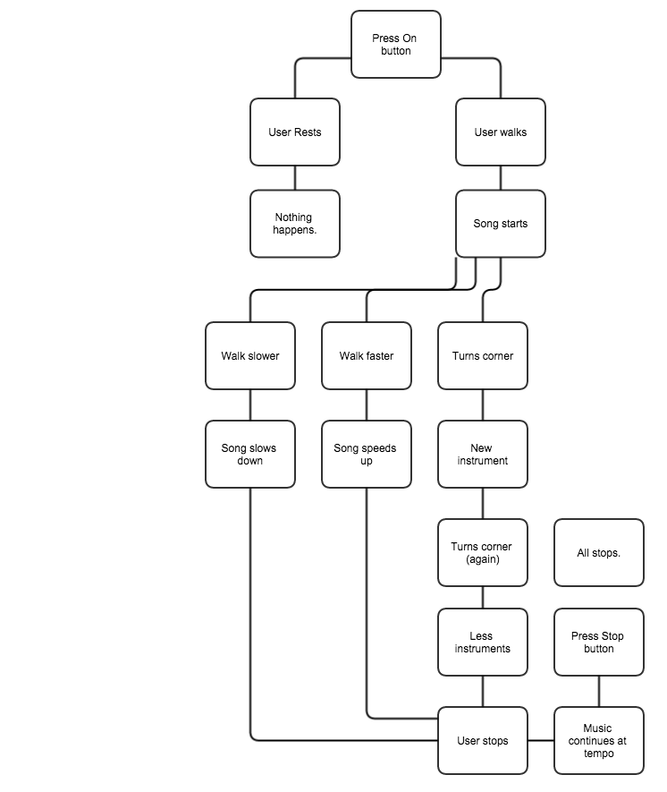
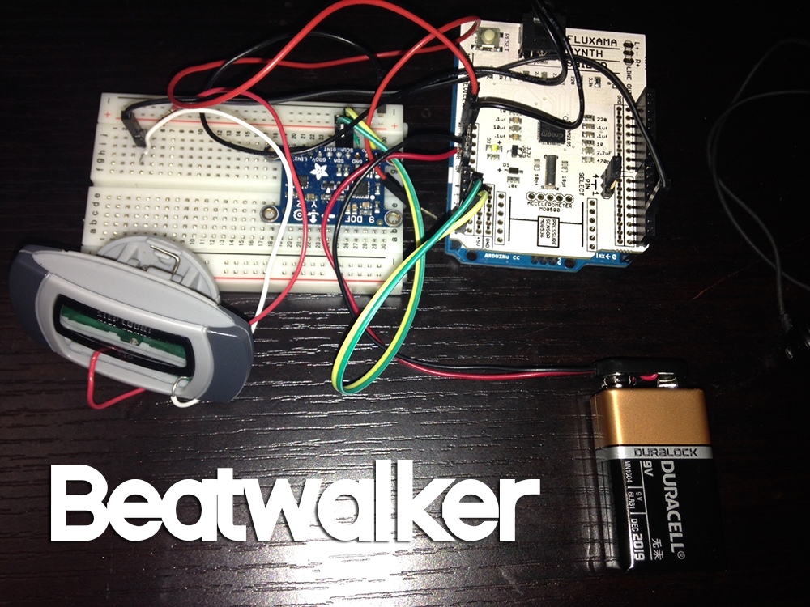
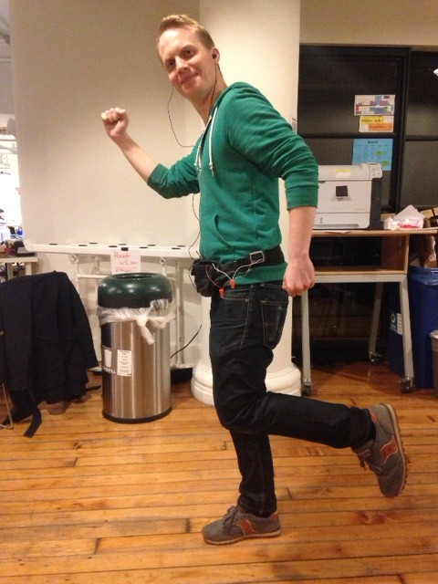

The goal was to make the soundtrack of the user’s life. Previously created songs would play as a user walks wearing the Beatwalker. As the user changes their speed, their direction, and as their surrounding become more or less intense, Beatwalker responds to that and the music will shift accordingly.

An Arduino with a music making shield is neatly fitting into a fanny pack (because they’re still cool!) equipped with an accelerometer and a magnetometer. A song, written by myself, plays and speeds up or slow downs based on the tempo the user is walking at. Since the music is midi-based, the speed has nothing to do with the pitch of the music. When a user changes more than 90 degrees over a short amount of time, a new instrument will be introduced or eliminated from the song. In theory, this will become a constantly changing song, that’s one of a kind for that particular user.

Everything that I created for Beatwalker could be slimmed down and put into a phone as an app. Using a great music library like tone.js would really improve the quality of particular songs and offer more variety. There would also be a very useful application with the beat detection algorithm to curate playlists for users with the music they already have on their phone. For example, based on the tempo they’re running at the gym, the next song could be at that tempo. This will become a project I’ll follow up on post-ITP.

