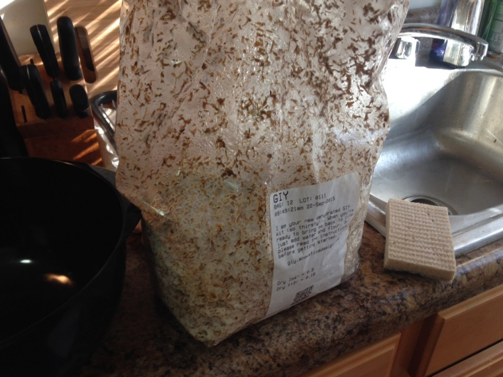
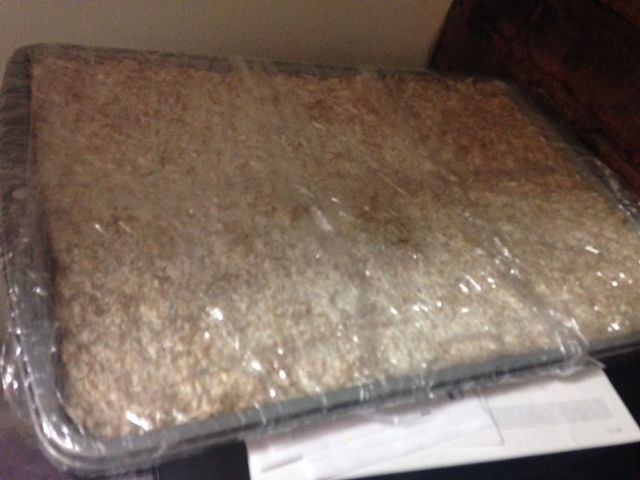
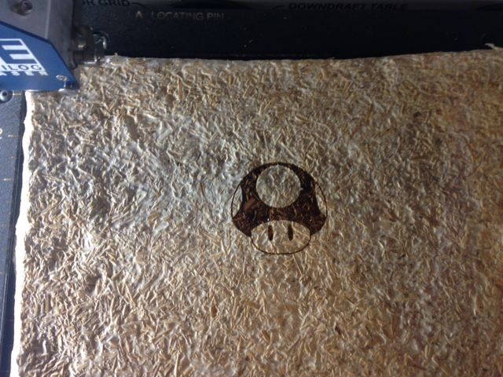

  Given the plethora of material options for laser cutters that are bad for the environment, I wanted to experiment with an up-and-coming (yet old as time) material – mushroom fungus (referred to as myco foam).

Purchased a GIY (grow it yourself) kit from Evocative, let the myco foam grow, put it in the oven to harden and kill it, and then laser cut.

Myco foam is great for etching, but it cuts very poorly and burns easily.

