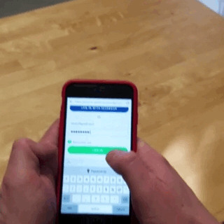

The AR Record Box is a fun experiment to use Google's WebARonARKit in conjunction with three.js and the Spotify API. A user can login to their Spotify account, place their record box on a surface, swipe through 20 albums from their Spotify library, and select an album to listen to.

If you would like to see this working on your phone, you will need to have an Apple Developer's account, and follow the instructions to get WebARonArKit working on your device. Afterwards, you can either clone this repo and start a local server (using node app.js) to visit through the webview in the WebARonARKit app, or visit where I currently have this hosted.

You can snoop my code and try downloading it on <a href="https://github.com/saxani/ar-record-box">github</a>.
 
