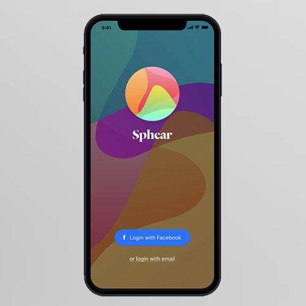
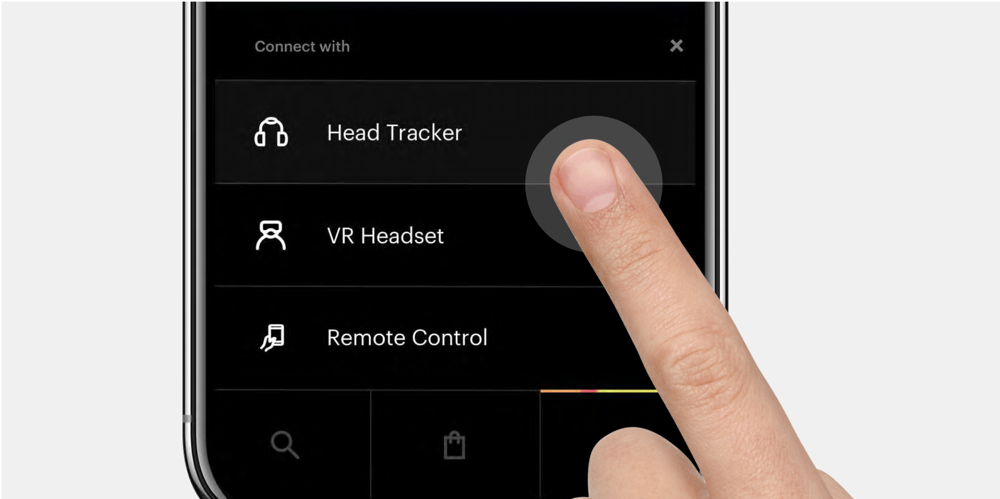

While working with VR, I was exposted to spatial audio. In many ways it was more immersive than the visual component, as the audio was high fidelity while the images were pixelated when blown up to a full headset. In the ambisonic format we utilized, audio is mapped to a point in 3D space. If you face towards it, the audio gets louder, and as you turn away, it gets quieter. It stuck with me, and as a musician, I wanted to explore the idea of creating original music meant to be played in the spatial audio format.

</img>

Years later, I began collaborating with other musicians to create some rich music that was meant to 'move around a listener'. In conjunction with that, we prototyped a mobile app that was meant to be a new platform for ambisonic audio.

'Sphear' lets you listen to originally created ambisonic audio in 3 ways:

1. With a headtracker on your headphones, so you can move around a 3D space without needing a headset
2. With a VR headset and accomppanying visuals
3. Using your phone as a remote control - as you turn it, the audio will move with it as if it's diecting your listening in a 3D space.

The concept was accepted to Toronto-based tech accelerator Ideaboost. It was hard to focus enough time on the project, and it has proven difficult to utilize the web audio API in conjunction with Pro Tools ambisonic audio tools to create an incredible, immersive experience. But the idea is still in development.

This music video was created by Kat Sullivan, with a song we created for ambisonic audio. Our goal of the platform was to have much higher resolution audio than what YouTube provides. But YouTube does have the audio positioned in the correct spot.

<iframe width="560" height="315" src="https://www.youtube.com/embed/JA1sjXwQwJc?si=_vQOU8Jix1kBtN_T" title="YouTube video player" frameborder="0" allow="accelerometer; autoplay; clipboard-write; encrypted-media; gyroscope; picture-in-picture; web-share" allowfullscreen></iframe>

