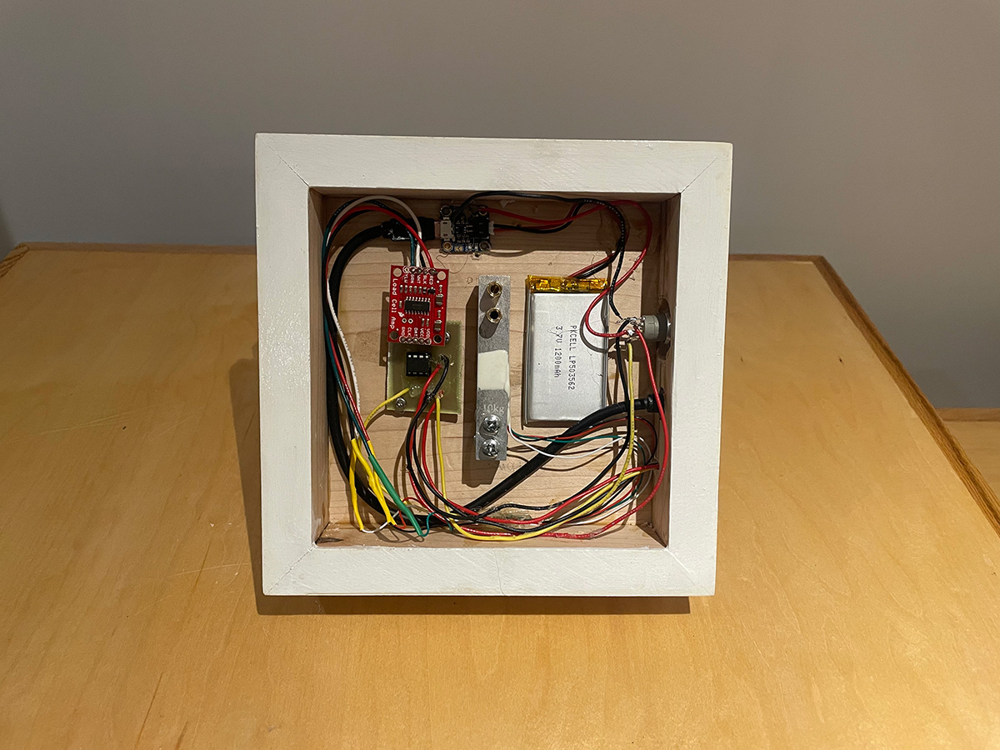

For my nephew's 1st birthday, which happens to be very close to a dear friend's daughters birthday, I wanted to experiment with making toy blocks with a bigger payoff.

I created two toy block sets with neopixels around the base that would respond to the colour of block being put on the base with the appropriate lights flickering. It's a pleasant sensory experience for toddlers.

<video width="100%" height="auto" controls poster="../../images/BlocksDemo.png">
  <source src="../../videos/BlocksDemo.webm" type="video/webm">
  <source src="../../videos/BlocksDemo.mp4" type="video/mp4">
</video>

The blocks were painted with non-toxic paint and covered in a non-toxic top coat for durability.

I made a custom circuit board with an IC running Arduino software. A weight sensor is what calculates what block/combo of blocks is on the base at any one time. There's also a rechargable LiPo battery.

I learned that toddlers are VIOLENT with their toys. Despite trying to make the best and rod as solid as possible with screws and glue, both toddlers broke theirs within a month. They really did enjoy them though! Going forward I'd like to make a more robust version to handle a beating.

<video width="320px" height="auto" controls poster="../../images/Toddler_And_Blocks.png">
  <source src="../../videos/Toddler_And_Blocks.webm" type="video/webm">
  <source src="../../videos/Toddler_And_Blocks.mp4" type="video/mp4">
</video>
