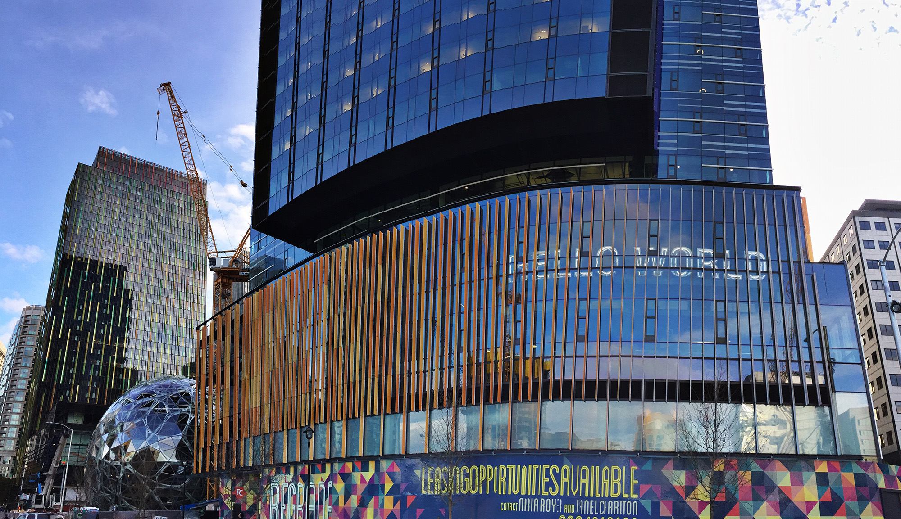
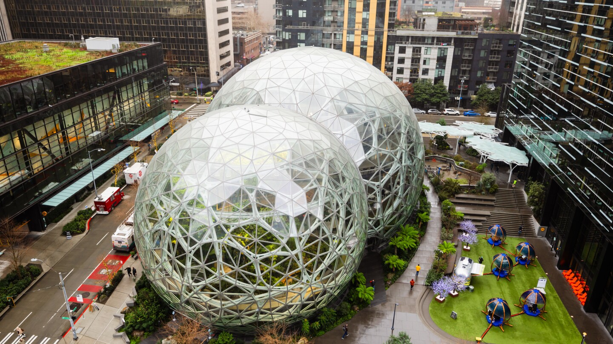

  Working out of HQ1's  <a href="https://en.wikipedia.org/wiki/Day_1_(building)" target="_blank" rel="noreferrer">Day One</a> building in Seattle, I joined the Amazon Device Design Team. Our team focuses on conceptualization and prototyping of next-generation products, spanning all of Amazon's existing and upcoming products as well as how they leverage Alexa+. 

  The two main ways we work are in small multi-disciplinary pods to invent new devices and experiences (1-5 years out), or in larger groups to prototype upcoming products for stakeholder buy-in and user testing (0-1 year out). As a design technologist, I would offer a technical lens while teams work to solve customer problems, and as our products solidify, I am the first person to prototype them. Through this I need to balance historical Amazon design and technical architecture, while utilizing innovative solutions to make new experiences. 

  I can't discuss specifics regarding upcoming products, but I've been a lead on tablet and Echo projects, and I've especially focused on making Amazon's product line more consistent and seamless when working together.  

