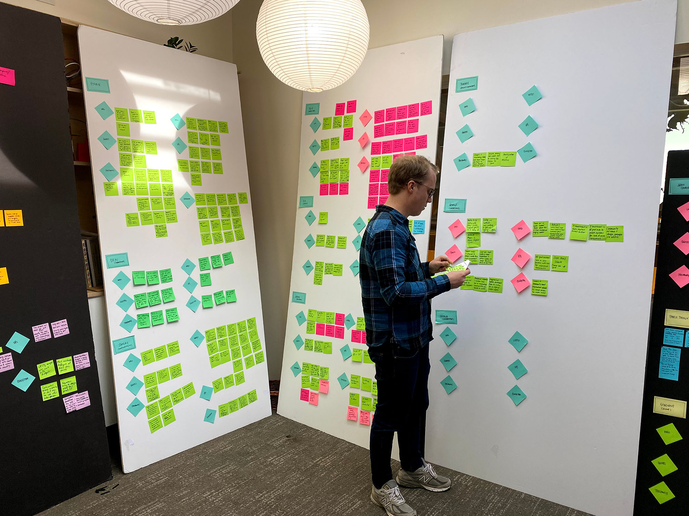

  Reknowned design thinking agency <a href="https://ideo.com/" target="_blank" rel="noreferrer">IDEO</a> partnered with <a href="https://www.orbia.com/" target="_blank" rel="noreferrer">Orbia</a>, a purpose-driven global infrastructure company, to create a venture lab that would design new digital products and services that were good for the company and good for the world. I was fortunate to be the first employee hired in the lab, based in the IDEO office in San Francisco. 

  We were a small team of four who would recruit domain experts from the IDEO roster as needed depending on the projects. We worked with different Orbia departments to identify opportunity areas. We spoke with customers to understand customer needs, and we designed and prototyped solutions. 

  Some of our work included a marketplace for second-life batteries from electric vehicles, a community-based app to connect municipalities to each other working to solve water infrastructure issues, a next generation inhaler, and a revolutionary indoor air quality solution. 

