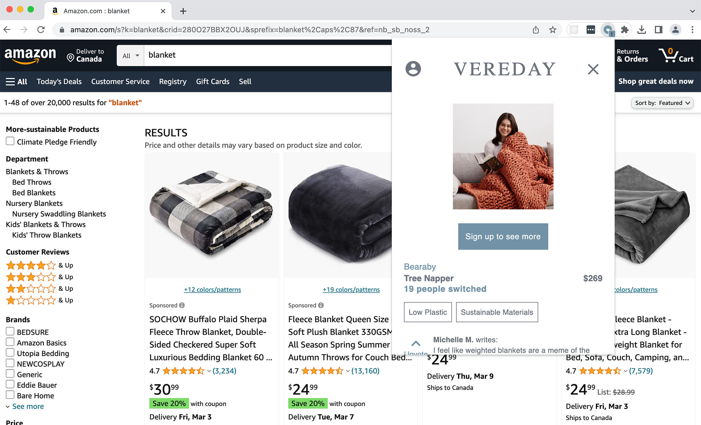
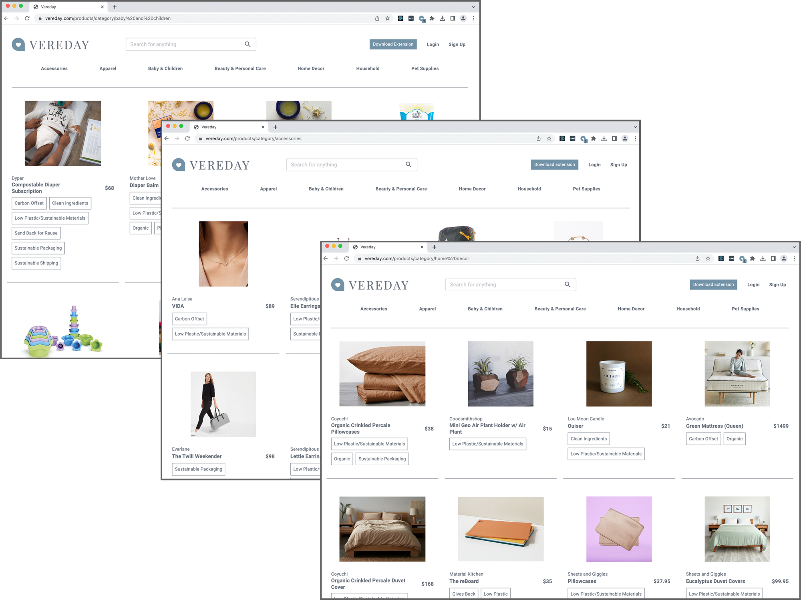

  Vereday is a browser extension that seamlessly offers sustainable shopping alternatives. While shopping on Amazon, if Vereday has products in its database that matches what a user is searching for, it will alert them and show options. Based on recommendations from others, and given a user's priorities (i.e. Organic, sustainable packaging, etc), it becomes possible for someone who wants to make sustainble decisions the opportunity to do so at point-of-sale. 

  Two successful co-founders in Silicon Valley approached me with the concept, and it intrigued me. I built the entire site using a modern stack and tooling. Further plans include expanding to be a multi-browser extension and working with online shopping sites besides Amazon. We'd also like to utilize image recognition to further match sustainable suggestions beyond just keywords. 

  The browser extension is accompanied by a full online website. You can check it out at <a href="https://vereday.com" target="_blank" rel="noreferrer">vereday.com</a>

